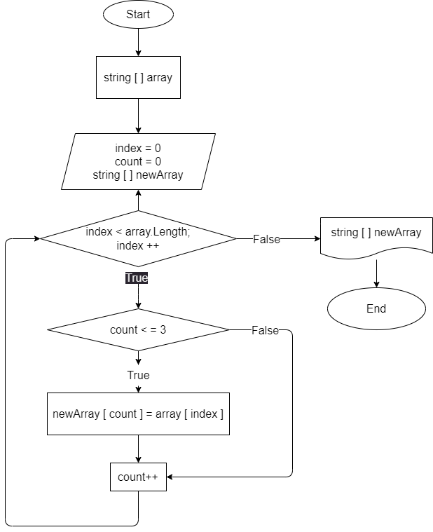

# Итоговая проверочная работа
## **Задача:**

### Написать программу, которая из имеющегося массива строк формирует новый массив из строк, длина которых меньше, либо равна 3 символам. Первоначальный массив можно ввести с клавиатуры, либо задать на старте выполнения алгоритма.

### При решении не рекомендуется пользоваться коллекциями, лучше обойтись исключительно массивами.

*Примеры:*

[“Hello”, “2”, “world”, “:-)”] → [“2”, “:-)”]

[“1234”, “1567”, “-2”, “computer science”] → [“-2”]

[“Russia”, “Denmark”, “Kazan”] → []

## **Описание выполнения работы:**

1. Создала репозиторий на GitHub
2. Нарисовала блок-схему главного метода из решения задачи
3. Снабдила репозиторий оформленным текстовым описанием решения
4. Написала программу, решающую поставленную задачу
5. Использовала контроль версий (создано более 5 коммитов)

[Код](Program.cs)

## **Текстовое описание решения задачи:**

* Дан массив из строк. Выводим его на экран с помощью метода Void 
* Задаем новый массив и дополнительную переменную count
* Далее вводим метод Void для нахождения строк, длина которых меньше, либо равна 3 символам 
* С помощью цикла перебираем все элементы по длине исходного массива
* Если длина строки оказывается меньше, либо равна 3, то этой строке присваиваем значение count нового массива. Иначе, count будет равен нулю
* Выводим новый массив на экран с помощью метода Void